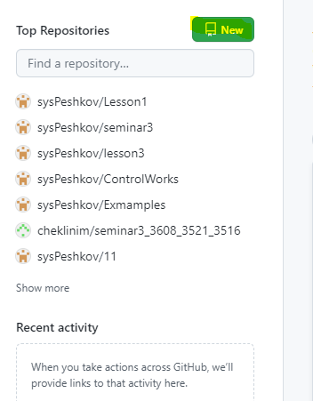

# ControlWorks
Контрольная работа 1й четверти курса разработчик на сайте GeekBrains

В данном файле представлено описание задачи и алгоритм решения

## Задание

## Задача

## Примеры

## Решение

### Репозиторий

В первую очередь создадим репозиторий на github, для этого выполним ряд действий:

1. Нажмем на стартовой странице [github](https://github.com/) на __New__

2. Заполняем:
 - Repository name
 - Проставляем галочку __Add a README file__ 
 - Выбираем в __Add .gitignore__ значение _С_

 Поздравляю, репозиторий создан.

 Далее, необходимо связать удаленный репозиторий с локальным.

 Для этого:

 1. В консоле  Visial Code выполняем команду    

  >  git remote add origin <ссылка на репозиторий>

2. Создаем в локальном ветку main

 >   git branch -M main

 3. Автоматически push будет в репозиторий гитхаб указанный как origin и в ветку main, настраиваем командой

 > git push -u origin main

4. Затем выполняем команду, которая приведет в соответсвие локальный репозиторий относительно удаленного

 > git pull

 Супер, Теперь репозиторий подготовлен для работы

 Вот, например, мой - [Репозиторий](https://github.com/sysPeshkov/ControlWorks)